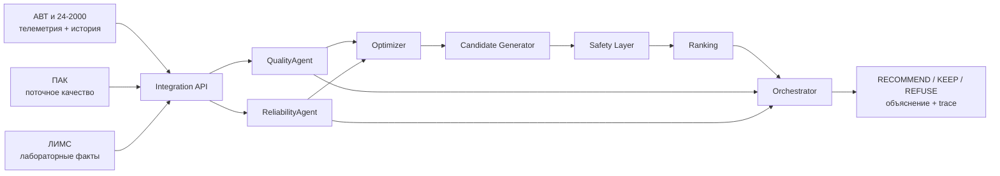

# Нефтекод 2.0

**Мультиагентная система поддержки оператора нефтеперерабатывающего производства, созданная для хакатона «Нефтекод 2.0».** Система принимает текущее состояние АВТ и установки гидроочистки 24-2000, оценивает качество продукта и режимный риск, перебирает допустимые сценарии управления и возвращает одно из трёх объяснимых решений: `RECOMMEND`, `KEEP` или `REFUSE`.

Проект работает локально, не требует LLM и может запускаться в закрытом контуре. Модели, оптимизатор, оркестратор, API и операторский интерфейс объединены в единый воспроизводимый программный маршрут.

> **[Презентация защиты — Нефтекод 2.0](neftecode_2_0_hackathon_final.pptx)**

## Быстрый запуск

### Docker Compose — рекомендуемый способ

Требования:

- Docker Desktop с Linux containers;
- свободные порты `4173` и `8000`.

Откройте PowerShell в корне репозитория и выполните:

```powershell
Set-Location project
docker compose up --build -d
docker compose ps
```

Первый запуск собирает image и может занять несколько минут. После запуска оба
сервиса в выводе `docker compose ps` должны перейти в состояние `healthy`.

Доступные адреса:

- операторский интерфейс: <http://127.0.0.1:4173>;
- Swagger API: <http://127.0.0.1:8000/docs>;
- состояние системы: <http://127.0.0.1:8000/api/v1/health>;
- офлайн-бенчмарк: [project/integration/dashboard/benchmark.html](project/integration/dashboard/benchmark.html).

Проверить API:

```powershell
Invoke-RestMethod http://127.0.0.1:8000/api/v1/health
```

Журналы обоих сервисов:

```powershell
docker compose logs -f
```

Выйдите из просмотра журналов через `Ctrl+C`.

Остановить стек:

```powershell
docker compose down
```

Runtime-журналы сохраняются в именованном volume `neftecode-runtime`. Для
последующих запусков достаточно `docker compose up -d`; после изменения кода
используйте `docker compose up --build -d`.

### Локальный запуск в Windows без Docker

Требования:

- Windows 10/11;
- Python 3.11 или новее;
- около 1 ГБ свободного места для виртуального окружения.

Откройте PowerShell в корне репозитория и выполните:

```powershell
python -m venv project\.venv
.\project\.venv\Scripts\python.exe -m pip install --upgrade pip
.\project\.venv\Scripts\python.exe -m pip install -r requirements.txt
```

Запустите API в первом терминале:

```powershell
Set-Location project
.\.venv\Scripts\python.exe -X utf8 -m neftecode_integration.main --host 127.0.0.1 --port 8000
```

Во втором терминале, также из каталога `project`, запустите интерфейс:

```powershell
.\.venv\Scripts\python.exe -m http.server 4173 --bind 127.0.0.1 --directory orchestrator/frontend/dist
```

После запуска доступны:

- операторский интерфейс: <http://127.0.0.1:4173>;
- Swagger API: <http://127.0.0.1:8000/docs>;
- состояние системы: <http://127.0.0.1:8000/api/v1/health>;
- офлайн-бенчмарк: [project/integration/dashboard/benchmark.html](project/integration/dashboard/benchmark.html).

Проверить API из PowerShell:

```powershell
Invoke-RestMethod http://127.0.0.1:8000/api/v1/health
```

Остановить сервисы можно сочетанием `Ctrl+C` в обоих терминалах.

## Что решает проект

Исходная задача хакатона — построить мультиагентную систему, которая не просто прогнозирует один показатель, а объединяет несколько ролей:

1. получает технологическое состояние процесса;
2. оценивает ожидаемое качество продукта;
3. оценивает тяжесть и необычность режима;
4. генерирует множество вариантов управления;
5. проверяет варианты по технологическим ограничениям;
6. ранжирует оставшиеся варианты;
7. формирует объяснимое решение `RECOMMEND`, `KEEP` или `REFUSE`.

Рассматриваемая технологическая цепочка:

```text
АВТ → сырьевые фракции → гидроочистка 24-2000 → смешение компонентов → товарное дизельное топливо
```

## Архитектура



В проекте пять устанавливаемых Python-пакетов:

| Компонент | Роль |
| --- | --- |
| `Quality_neftecode` | Прогноз серы, интервала и вероятности нарушения; контроль состояния ПАК; модель товарного смешения |
| `reliability_agent` | Индекс отклонения технологического режима по четырём группам оборудования |
| `neftecode_optimizer` | Генерация кандидатов, Safety-проверка и ранжирование допустимых вариантов |
| `orchestrator` | Детерминированное итоговое решение и объяснение |
| `integration` | Общий контракт, адаптеры, таймауты, HTTP API, сценарии и frontend |

Компоненты обмениваются строгими Pydantic-контрактами. Любая ошибка обязательного компонента, недостаток критичных данных или неизвестное состояние переводит расчёт в безопасный отказ.

## Данные

| Источник | Что содержит | Как используется |
| --- | --- | --- |
| АВТ | Температуры, давления, расходы и уровни первичной переработки | Описание текущего режима и признаки моделей |
| 24-2000 | Телеметрия гидроочистки: реактор, сырьё, газ, продукт | Признаки качества и режимного риска |
| ПАК | Частые измерения поточного анализатора | Текущая online-оценка серы и плотности; контроль состояния сигнала |
| ЛИМС | Лабораторные измерения | Обучающая цель и контроль качества прогноза по фактическому результату |
| ВАК | Расчётные показатели по инженерным формулам | Дополнительные признаки и сопоставление с лабораторной целью |
| КИП и технологические схемы | Расшифровка тегов и физический контекст | Сопоставление сигналов с оборудованием и проверка смысла признаков |

Телеметрия представлена десятиминутной сеткой за период с 2023 по август 2026 года. Для QualityAgent одна обучающая строка соответствует одной реальной пробе ЛИМС, а не каждой строке телеметрии. Время ЛИМС трактуется как время отбора пробы; в online-контуре результат считается доступным через четыре часа.

Исправленный справочник 24-2000 подтверждает ключевые теги сценарной модели:

- `T6` — температура газосырьевой смеси на входе Р-202;
- `F9` — массовый расход сырья на установку;
- `P13` — давление на входе Р-202.

## QualityAgent

QualityAgent отвечает на вопрос: **каким будет качество продукта и насколько вероятно нарушение ограничения по сере?**

Обучающая постановка:

- target регрессии — лабораторная сера `Mg.Sulfur`;
- target классификации — превышение `S > 10 мг/кг`;
- 1 462 лабораторные пробы, 1 458 пригодных строк;
- 661 baseline-признак;
- текущие значения, лаги 30/60/120/240/360 минут, rolling-статистики и тренды;
- календарное разделение train/validation/test без перемешивания;
- blocked expanding OOF с шестичасовым gap.

Активный runtime использует гибрид H+C:

- **H** — CatBoost-модель поправки к ПАК, интервала и риска;
- **C** — резервная telemetry-only модель;
- при исправном ПАК его значение остаётся точечной оценкой, а ML даёт вероятность нарушения и интервал;
- при `FLATLINE`, `STALE`, `MISSING` или неподтверждённом скачке ПАК включается модель C;
- модель использует до шести часов предшествующей истории процесса.

На test-периоде:

| Оценка | MAE, мг/кг | Дополнительные показатели |
| --- | ---: | --- |
| H, residual к ПАК | 1,3629 | покрытие 80% интервала — 84,16%; PR-AUC — 0,5981 |
| Текущий ПАК | 1,3128 | baseline на 101 сопоставимой пробе |
| C, только телеметрия | 1,5888 | PR-AUC — 0,5897 |

В runtime ПАК используется как точечная оценка, а ML дополняет её оценкой риска, доверительным интервалом и резервным прогнозом по телеметрии.

Для кандидатов `T6/F9/P13` применяется отдельная прозрачная линейная what-if модель с горизонтом 0–3 часа. Её коэффициенты изолированы от основной CatBoost-модели.

Товарное качество рассчитывается отдельной моделью смешения. Она проверяет серу, T95, плотность, цетановое число, сумму долей компонентов и присадку. Рецептура должна быть явно передана во входе.

## ReliabilityAgent

ReliabilityAgent отвечает на вопрос: **насколько текущий или предложенный режим отличается от исторически наблюдавшейся рабочей области?**

Он независимо оценивает четыре группы:

- печь П-3 АВТ;
- колонну К-10 АВТ;
- колонну К-2 АВТ;
- общий режим гидроочистки 24-2000.

Модель объединяет Isolation Forest, отклонение отдельных сигналов от исторических квантилей, контроль полноты данных и опциональные технологические пределы. Результат содержит:

- `reliability_risk`: `LOW`, `MEDIUM`, `HIGH` или `UNKNOWN`;
- `risk_score` от 0 до 1 либо `null` при невозможности оценки;
- `data_confidence`;
- факторы риска и детализацию по узлам;
- предупреждения о пропусках, stale/flatline и границах применимости.

## Optimizer и Safety

Candidate Generator строит `NO_CHANGE` и сетку вариантов изменения параметров. Настроены шесть сценарных управлений:

- `hyd_t6`, `hyd_f9`, `hyd_p13`;
- доля гидроочищенного компонента;
- доля низкосернистого компонента;
- цетаноповышающая присадка.

За один запрос рассматривается до 100 вариантов и до двух одновременно изменяемых параметров.

Safety проверяет до ранжирования:

- наличие обязательных данных;
- границы и максимальный шаг управляющих параметров;
- применимость модели;
- серу по точечной и верхней интервальной оценке;
- T95, плотность, цетановое число, состав смеси и дозировку присадки;
- качество данных и оценку Reliability;
- происхождение входа и результатов агентов.

Варианты ранжируются лексикографически: вероятность нарушения качества → режимный риск → относительная стоимость → производственный эффект → размер действия.

## Orchestrator и итоговое решение

Orchestrator ничего не предсказывает повторно. Он проверяет согласованность результатов компонентов и применяет воспроизводимую политику:

| Решение | Условие |
| --- | --- |
| `RECOMMEND` | Есть лучший изменяющий кандидат, он прошёл Safety, вход LIVE, оценки подтверждены и общая уверенность HIGH |
| `KEEP` | Текущий режим допустим, а безопасного и достаточно подтверждённого улучшения нет |
| `REFUSE` | Не хватает данных, обязательный компонент ошибся, текущий режим не прошёл Safety либо расчёт вышел за область доказательств |

Средней уверенности достаточно для `KEEP`, но недостаточно для `RECOMMEND`. Низкая или неизвестная уверенность приводит к `REFUSE`. Все решения содержат reason codes, объяснение и trace ID.

## API

Основные маршруты:

| Метод и путь | Назначение |
| --- | --- |
| `GET /api/v1/health` | Состояние моделей и режимы адаптеров |
| `POST /api/v1/evaluate` | Полный расчёт из `ProcessState` и истории |
| `POST /api/v1/decide` | Решение по уже рассчитанным результатам компонентов |
| `GET /api/v1/runs/{run_id}` | Получение сохранённого расчёта |
| `GET /api/v1/scenarios` | Каталог редактируемых what-if сценариев |
| `POST /api/v1/scenarios/{id}/evaluate` | Выполнение сценария |
| `GET /api/v1/examples` | Примеры с описанным происхождением данных |
| `POST /api/v1/data-upload/evaluate` | Загрузка CSV/XLSX, подготовка состояния и запуск расчёта |
| `POST /api/v1/shadow/lims` | Добавление нового лабораторного факта в shadow-журнал |
| `GET /api/v1/shadow/status` | Shadow-метрики и readiness gates |

`POST /api/v1/evaluate` принимает до 1 000 исторических состояний. Будущие точки истории отклоняются. Вход явно маркируется как `SYNTHETIC`, `HISTORICAL` или `LIVE`; источник не угадывается по значениям датчиков.

Маршрут загрузки принимает обязательные `avt_tags.csv`, `242000_tags.csv`, ЛИМС и справочник тегов, а ПАК — опционально. Максимальный общий размер — 600 МБ.

## Воспроизводимые сценарии

В проекте сохранены два основных сквозных примера:

1. `integration/examples/historical_20260515_1000.json` — исторический срез для проверки решения `REFUSE` при запросе без плана смешения.
2. `integration/examples/illustrative_blend_20260515_1200.json` — сценарий с измеренной телеметрией, ПАК и смесью 80/20. Ожидаемый итог: `KEEP`, прогноз серы около 7,27 мг/кг и лучший вариант `NO_CHANGE`.

## Проверка

На собранной версии прошли **186 автоматических тестов** без ошибок и пропусков. Дополнительно пройден smoke-тест интерфейса: восемь сохранённых сценариев и три типа решений.

Для повторного запуска установите тестовые зависимости:

```powershell
.\project\.venv\Scripts\python.exe -m pip install "pytest>=8,<10" "pytest-asyncio>=0.25,<2" "httpx>=0.28,<1"
Set-Location project
.\.venv\Scripts\python.exe -m pytest -q integration/tests neftecode_optimizer/tests orchestrator/tests Quality_neftecode/tests reliability_agent/test_agent.py
```

Тесты проверяют контракты, временную корректность признаков, обработку пропусков, fallback-маршруты, генерацию кандидатов, Safety, решения Orchestrator и сквозной HTTP-вызов.

## Структура репозитория

```text
Neftecode_relise/
├── README.md                 ← этот документ
├── requirements.txt          ← установка всех локальных пакетов
├── project/                  ← исполняемая система
│   ├── Quality_neftecode/
│   ├── reliability_agent/
│   ├── neftecode_optimizer/
│   ├── orchestrator/
│   ├── integration/
│   ├── neftecode_processing.py
│   └── Dockerfile
├── research/                 ← исходные данные, ТЗ и исследования
│   ├── data/data/            ← CSV АВТ и 24-2000
│   ├── Quality_neftecode/    ← исследовательские витрины и эксперименты
│   ├── neftecode_chat/       ← исправленные справочники и схемы
│   ├── notion/               ← экспорт рабочих исследований
│   └── изучение данных/
└── defense/                  ← сценарий и дополнительные материалы защиты
```

Готовые model bundles и демонстрационные запросы находятся в `project`. Каталог `research` содержит исходные материалы для воспроизводимости, повторной подготовки данных и дальнейших экспериментов.

## Результаты исследования

- ЛИМС используется как эталонный источник лабораторных показателей качества.
- ПАК формирует оперативную точечную оценку, а ML рассчитывает риск, интервал и резервный прогноз.
- Временные окна и past-only признаки связывают лабораторные результаты с предшествующей историей процесса.
- ReliabilityAgent оценивает отклонение текущего режима от исторической рабочей области и достоверность входных данных.
- Optimizer совместно учитывает качество, режимный риск, стоимость, производственный эффект и величину управляющего действия.
- Orchestrator формирует воспроизводимое решение `RECOMMEND`, `KEEP` или `REFUSE` с объяснением и trace ID.

## Материалы проекта

- [Сценарий демонстрации](defense/DEMO_CHECKLIST.md)
- [Презентация защиты](neftecode_2_0_hackathon_final.pptx)
- [Результат проверки сборки](VERIFICATION.md)
- [Подробная документация Integration API](project/integration/README.md)
- [Описание QualityAgent](project/Quality_neftecode/README.md)
- [Описание ReliabilityAgent](project/reliability_agent/README.md)
- [Описание Optimizer и Safety](project/neftecode_optimizer/README.md)
- [Описание Orchestrator](project/orchestrator/README.md)
- [Описание рецептуры и управляющих параметров](project/neftecode_optimizer/docs/recipe_and_controls_audit.md)

Исходное ТЗ, технологические схемы, исправленные справочники тегов, выгрузки и история исследования сохранены в каталоге `research`.
