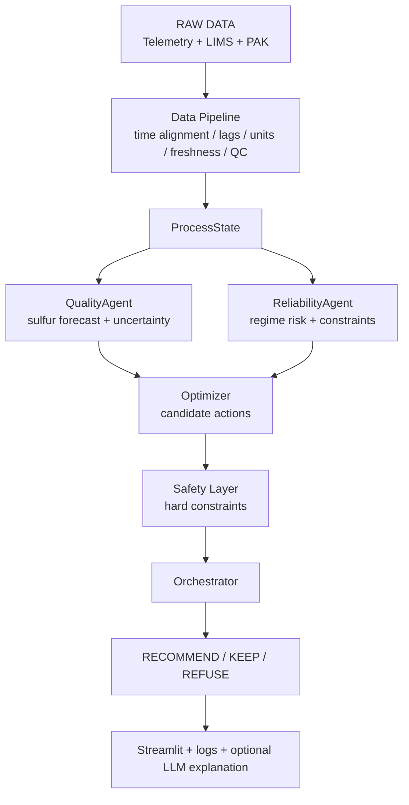
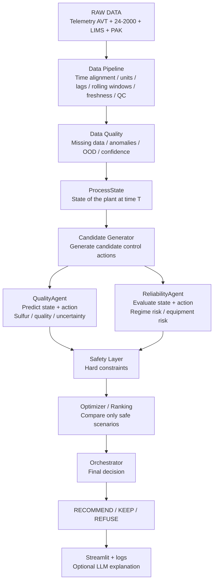

# Архитектура и план разработки МАС (первый взгляд)

<aside>
🎯

**Цель к 22 сентября:** получить воспроизводимый прототип мультиагентной системы, который по историческому состоянию установки оценивает качество и риск режима, перебирает несколько безопасных управляющих воздействий и либо выдаёт объяснимую рекомендацию, либо обоснованно отказывается её давать.

</aside>

## На чём фокусируемся

Фокус проекта:

**time-aware ML + constrained optimization + safety**

Система должна уметь:

1. собрать состояние процесса на конкретный момент времени;
2. проверить качество, полноту и свежесть данных;
3. спрогнозировать показатель качества с учётом технологического запаздывания;
4. оценить риск тяжёлого/нежелательного режима;
5. сгенерировать несколько вариантов управляющих воздействий;
6. отбросить варианты, нарушающие жёсткие ограничения;
7. сравнить оставшиеся сценарии;
8. выдать рекомендацию, сохранить текущий режим или отказаться от совета;
9. объяснить решение оператору.

## Какие ML-задачи есть в задании

| Задача | Тип | Базовый подход |
| --- | --- | --- |
| Прогноз содержания серы | Regression / soft sensor | CatBoost / LightGBM |
| Прогноз качества через технологический лаг | Time-aware supervised forecasting | Lagged features + CatBoost; transformer — как эксперимент |
| Риск S > 10 мг/кг | Classification / probabilistic prediction | Probability / quantile model |
| Плохие или нетипичные данные | Anomaly / OOD detection | Правила + robust ranges / IsolationForest |
| Тяжесть режима | Risk scoring | Rule-based / proxy metric; ML не обязателен |
| Поиск управляющих воздействий | Constrained optimization | Grid/random search, SciPy, Optuna |
| Уверенность прогноза | Uncertainty estimation | Quantile regression / conformal prediction |
| Объяснение оператору | Explainability | SHAP + правила + опционально LLM |

## Расклад по моделям

Рекомендуемая последовательность:

1. Трансформер
2. LSTM
3. CatBoost или LightGBM
4. Chronos / TimesFM

Потом их сталкиваем на ринге https://github.com/YuAn-06/Industrial-Time-Series-Soft-Sensor и делаем вывод кто лучше

[LostRunes github link](https://github.com/LostRunes/debutanizer-model?utm_source=chatgpt.com)

[InduTS-SS github link](https://github.com/YuAn-06/Industrial-Time-Series-Soft-Sensor?utm_source=chatgpt.com)

[SRU LSTM github link](https://github.com/iDharshan/Efficient-SRU-Optimization-via-Deep-Learning-driven-LSTM-Dynamical-Models?utm_source=chatgpt.com)

[IDAES PSE github link](https://github.com/IDAES/idaes-pse?utm_source=chatgpt.com)

/c69a41d0-ecc6-4293-b566-e022d6d8c812.png)

## Целевая архитектура системы



### Логические агенты

```
QualityAgent.predict()
ReliabilityAgent.evaluate()
OptimizerAgent.search()
Orchestrator.decide()
```

Агенты не обязаны быть LLM-агентами. Для текущей задачи лучше, чтобы это были обычные Python-классы/сервисы с прозрачными входами и выходами.

## Как организовать команду

Работу лучше делить не на пять независимых ролей, а на **четыре параллельных потока** с одним человеком, который усиливает текущее узкое место.

### Поток A — Data & Time

Отвечает за:

- загрузку ЛИМС, ПАК и телеметрии;
- словарь тегов и единиц;
- временную синхронизацию;
- возраст анализов;
- поиск/фиксацию технологических лагов;
- пропуски и аномалии;
- feature table;
- временные train/validation/test интервалы.

**Deliverable:** воспроизводимый `ProcessState` и processed dataset.

### Поток B — Quality ML

Отвечает за:

- naive baseline;
- CatBoost/LightGBM baseline;
- выбор lag/horizon;
- временную валидацию;
- uncertainty;
- SHAP;
- опциональный transformer benchmark.

**Deliverable:** `QualityAgent.predict(state, action)` + сохранённая модель + метрики.

### Поток C — Optimization + Safety

Работает независимо от готовности ML через mock-модель.

Отвечает за:

- 2–4 управляемых параметра;
- генерацию candidate actions;
- ограничения;
- сравнение сценариев;
- hard filters;
- objective/ranking;
- `NO_FEASIBLE_SOLUTION`;
- reliability proxy.

**Deliverable:** сценарный оптимизатор, который умеет найти допустимые действия или отказаться.

### Поток D — Integration & Demo

Держит систему целиком в рабочем состоянии.

Отвечает за:

- Pydantic-контракты;
- orchestrator;
- FastAPI;
- тесты;
- Streamlit;
- Docker;
- README;
- demo scenarios.

**Deliverable:** один end-to-end запуск из `main`.

### Поток E

Не получает отдельную пятую подсистему. Он усиливает bottleneck:

```
первые дни → Data
середина → ML / validation
затем → safety / scenarios
финал → integration / demo
```

## Контракты между потоками

Главная организационная договорённость — заранее зафиксировать интерфейсы.

Пример состояния процесса:

```python
class ProcessState(BaseModel):
    timestamp: datetime
    furnace_temp: float | None
    column_pressure: float | None
    feed_flow: float | None

    latest_lims_sulfur: float | None
    lims_age_hours: float | None

    pak_sulfur: float | None
    pak_age_minutes: float | None

    data_quality: str
```

Управляющее действие:

```python
class Action(BaseModel):
    furnace_temp_delta: float = 0
    feed_flow_delta: float = 0
    pressure_delta: float = 0
```

Результат прогноза:

```python
class QualityPrediction(BaseModel):
    sulfur_mgkg: float
    lower: float | None
    upper: float | None
    violation_probability: float | None
    confidence: str
```

Оценка сценария:

```python
class ScenarioEvaluation(BaseModel):
    action: Action
    sulfur_prediction: float
    sulfur_risk: float
    reliability_risk: float
    constraint_passed: bool
    violations: list[str]
    score: float | None
```

## Ключевой приём: mocks

Нельзя ждать, пока одна часть команды завершит работу, чтобы другая могла начать.

Пока реальная ML-модель не готова, используется mock:

```python
class MockQualityAgent:
    def predict(self, state, action):
        sulfur = (
            state.latest_lims_sulfur
            - 0.4 * action.furnace_temp_delta
            + 0.2 * action.feed_flow_delta
        )
        return QualityPrediction(...)
```

После этого:

```
MockQualityAgent
        ↓ заменить
CatBoostQualityAgent
```

Остальная система не переписывается.

<aside>
🔗

**Командный принцип:** каждый день существует один запускаемый end-to-end pipeline. Команда улучшает отдельные компоненты, но не держит пять несвязанных исследований до последнего дня.

</aside>

## Этапы разработки

### Версия 1 — Эскиз

**Цель:** доказать, что весь pipeline физически работает.

```
Data → один исторический ProcessState
ML → mock/baseline predictor
Optimization → candidate generator
Safety → S <= 10 + model ranges
Integration → orchestrator + CLI/Streamlit
```

Результат: один исторический момент проходит полный цикл и заканчивается `RECOMMEND`, `KEEP` или `REFUSE`.

### Версия 2 — Набросок

**Цель:** заменить заглушки реальными данными и baseline-моделью.

```
Mock State → real synchronized data
Mock Predictor → CatBoost
fake/model ranges → зафиксированные допустимые диапазоны
1 action → 2–4 controllable variables
```

Ожидаемые артефакты ML:

```
model.pkl
features.yaml
metrics.json
```

### Версия 3 — Этюд

**Цель:** доказать безопасность и границы применимости.

Обязательные кейсы:

- normal;
- high sulfur;
- missing LIMS;
- broken PAK;
- OOD state;
- unsafe recommendation;
- no feasible actions.

Для критических сценариев — automated tests.

### Версия 4 — Картина

**Цель:** заморозить решение и подготовить сдачу.

Замораживаем:

- датасет;
- temporal split;
- feature set;
- lag/horizon;
- model artifact;
- ограничения;
- objective;
- demo timestamps.

После freeze не добавляем новые исследования, кроме исправления блокирующих дефектов.

## Definition of Done

### ML-модель готова, если

- [ ]  есть temporal split;
- [ ]  проверено отсутствие leakage;
- [ ]  preprocessing воспроизводим;
- [ ]  model artifact сохранён;
- [ ]  реализован `predict()` API;
- [ ]  метрики сохранены;
- [ ]  есть тесты;
- [ ]  код merged в `main`.

### Оптимизатор готов, если

- [ ]  генерирует сценарии;
- [ ]  использует predictor API;
- [ ]  применяет hard constraints;
- [ ]  умеет выдавать альтернативы;
- [ ]  умеет вернуть `NO_FEASIBLE_SOLUTION`;
- [ ]  есть тесты;
- [ ]  код merged в `main`.

### Интеграция готова, если

- [ ]  один timestamp проходит весь pipeline;
- [ ]  возвращается только `KEEP`, `RECOMMEND` или `REFUSE`;
- [ ]  сохраняются входы, оценки агентов и итог;
- [ ]  demo запускается той же командой, что и обычный pipeline;
- [ ]  нет отдельного «магического» demo notebook

---

graph TD
RAW["RAW DATA<br>Telemetry AVT + 24-2000 + LIMS + PAK"] --> DATA["Data Pipeline<br>time alignment / units / lags / rolling windows / freshness / QC"]



### Что изменилось относительно исходной

1. **Добавили `Data Quality`**
Отдельно проверяем пропуски, аномалии, OOD и уверенность в данных.
2. **Добавили `Candidate Generator` до агентов**
Сначала генерируем варианты действий, потом `QualityAgent` и `ReliabilityAgent` оценивают **каждый конкретный сценарий**.
3. **QualityAgent теперь работает как `predict(state, action)`**
То есть прогнозирует не просто текущее качество, а последствия изменения режима.
4. **Safety перенесли перед Optimizer**
Сначала выкидываем все небезопасные сценарии, и только потом ранжируем оставшиеся.
5. **Optimizer теперь не генерирует действия, а ранжирует безопасные варианты**
Генерация и выбор разделены.

Коротко логика стала такой:

```
Состояние
→ варианты действий
→ прогноз последствий
→ проверка безопасности
→ выбор лучшего
→ RECOMMEND / KEEP / REFUSE
```