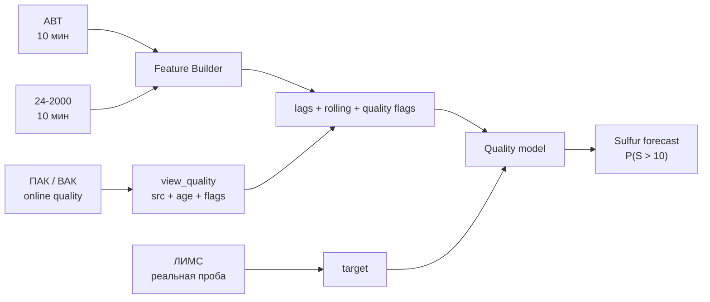
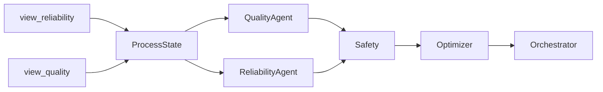

# ИЗУЧЕНИЕ ДАННЫХ

<aside>
🧭

**Итог исследования данных:** у нас уже есть не только сырые источники, но и подготовленный processed-слой с 10-минутными витринами, признаками качества данных и отдельными `train / val / test` файлами. При этом это **ещё не означает, что датасет полностью размечен для supervised ML**: техническая разметка качества есть, а корректность target-разметки нужно подтверждать через реальные пробы ЛИМС.

</aside>

## Исследования по источникам

[ТИМОФЕЙ](%D0%98%D0%97%D0%A3%D0%A7%D0%95%D0%9D%D0%98%D0%95%20%D0%94%D0%90%D0%9D%D0%9D%D0%AB%D0%A5/%D0%A2%D0%98%D0%9C%D0%9E%D0%A4%D0%95%D0%99%203d653f8f33c980c08fcafd4a3916a891.md)

[НИКИТА](%D0%98%D0%97%D0%A3%D0%A7%D0%95%D0%9D%D0%98%D0%95%20%D0%94%D0%90%D0%9D%D0%9D%D0%AB%D0%A5/%D0%9D%D0%98%D0%9A%D0%98%D0%A2%D0%90%203d653f8f33c980579b1bf621a087fff0.md)

[ПОЛИНА](%D0%98%D0%97%D0%A3%D0%A7%D0%95%D0%9D%D0%98%D0%95%20%D0%94%D0%90%D0%9D%D0%9D%D0%AB%D0%A5/%D0%9F%D0%9E%D0%9B%D0%98%D0%9D%D0%90%203d653f8f33c980fb8a41ca3cab49236e.md)

[ИСЛАМ](%D0%98%D0%97%D0%A3%D0%A7%D0%95%D0%9D%D0%98%D0%95%20%D0%94%D0%90%D0%9D%D0%9D%D0%AB%D0%A5/%D0%98%D0%A1%D0%9B%D0%90%D0%9C%203d653f8f33c9807ba933fa5bfc5735dd.md)

[ГЕРА](%D0%98%D0%97%D0%A3%D0%A7%D0%95%D0%9D%D0%98%D0%95%20%D0%94%D0%90%D0%9D%D0%9D%D0%AB%D0%A5/%D0%93%D0%95%D0%A0%D0%90%203d653f8f33c980c1a8dfde8a98d21a7e.md)

---

# Как состояние топлива попадает в модель

Главная идея после разбора всех источников — **модель не получает одну строку “состояния топлива” из одного файла**. Состояние собирается из нескольких источников, которые описывают разные части одной технологической цепочки:

```
АВТ — как сформировалась дизельная фракция
        ↓
24-2000 — в каком режиме шла гидроочистка
        ↓
ПАК / ВАК — что происходит с качеством оперативно
        ↓
ЛИМС — каким качество оказалось по лабораторному контролю
```

То есть модель учит связь:

```
история режима до момента t
        ↓
технологический лаг
        ↓
качество продукта в момент лабораторной пробы
```

<aside>
🎯

**Для обучения одна строка = одна реальная лабораторная проба ЛИМС.** Target не должен существовать на каждой 10-минутной точке просто потому, что последнее лабораторное значение можно протянуть вперёд.

</aside>

## 1. Что идёт в X — признаки модели

Для лабораторной пробы, отобранной в момент `t`, берём только информацию, которая была известна **до `t`**:

| Источник | Что передаём в модель | Что это означает |
| --- | --- | --- |
| **АВТ** | температуры, давления, расходы, состояние К-2 и дизельных фракций | в каком режиме сформировалось сырьё для последующей гидроочистки |
| **24-2000** | feed, температуры/давления реакторного блока, ΔP, ВСГ, квенч, стабилизация | как непосредственно шла гидроочистка |
| **ПАК / ВАК** | последнее доступное качество + `age / freshness` | оперативное состояние качества между ЛИМС-пробами |
| **предыдущий ЛИМС** | последний известный лабораторный результат + его возраст | может быть дополнительным признаком, если эксперимент это допускает |
| **Data Quality** | `missing / stale / outlier / filled` | насколько конкретному значению вообще можно доверять |

Из временных рядов строятся признаки вида:

```
lag: 30 мин / 1 ч / 2 ч / 4 ч / 6 ч / ...
rolling: mean / std / min / max / slope
age / freshness
quality flags
```

Лаг **пока не считается известной константой**. Его нужно подбирать на `train / validation` и не оптимизировать на `test`.

## 2. Что идёт в y — target

Target берётся **только из реального лабораторного ЛИМС** для выбранного показателя качества.

Текущие кандидаты:

- `Sulfur` — основной target для MVP;
- `T95`;
- `FlashPoint`;
- `D15`.

Каждый показатель — отдельная задача. ПАК и ВАК в target не подмешиваются.

Для серы имеет смысл обучать две связанные модели:

```
Regression:          прогноз Sulfur, мг/кг
Risk classification: P(Sulfur > 10 мг/кг)
```

По текущему исследованию ЛИМС найдено **1462 лабораторных замера серы**, медиана около **8.6 мг/кг**, примерно **15.7%** значений выше 10 мг/кг. Это значит, что класс риска реально представлен в истории и не является искусственным сценарием.

---

# Как выглядит online / inference-состояние

Для работы системы в реальном времени используется другая логика, чем для обучения.

На 10-минутной сетке собирается **ProcessState**:

```
view_reliability
  АВТ + 24-2000 telemetry
        +
view_quality
  качество + source + age + quality flags
        ↓
ProcessState
        ↓
QualityAgent / ReliabilityAgent
```

В `view_quality.csv` для каждого показателя уже хранятся:

```
<indicator>_value
<indicator>_age_min
<indicator>_src
<indicator>_flag_missing
<indicator>_flag_stale
<indicator>_flag_outlier
```

Для online-состояния допускается выбор лучшего доступного источника по логике **ЛИМС → ПАК → ВАК с учётом свежести**. Это не означает, что эти источники взаимозаменяемы при обучении.

Дальше модель может оценить не только текущее состояние, но и **candidate action**:

```
ProcessState + Candidate Action
        ↓
QualityAgent → прогноз качества / P(violation)
ReliabilityAgent → риск режима
        ↓
Safety
        ↓
Optimizer
        ↓
Orchestrator
        ↓
RECOMMEND / KEEP / REFUSE
```

Если прогноз кандидата нарушает жёсткое ограничение, например `S > 10 мг/кг`, такой сценарий должен отбрасываться **до** ranking.

---

# В каком состоянии данные сейчас

[Папка processed-данных в Google Drive](https://drive.google.com/drive/folders/1Dx1NZEDIggZrDVDOyFe1CzZTx40R5hgw)

В папке сейчас лежат:

| Файл | Что это | Статус |
| --- | --- | --- |
| `view_quality.csv` | 10-минутная витрина текущего качества + источник + возраст + `missing/stale/outlier` | **processed / технически размечен** |
| `view_reliability.csv` | витрина режимной телеметрии АВТ + 24-2000 и data-quality признаков | processed; структуру необходимо финально сверить с актуальным КИП |
| `view_orchestrator.csv` | единый 10-минутный срез ключевой телеметрии и quality-показателей | готов как общий state-layer / вход для orchestration |
| `split_train.csv` | обучающая часть | разделение уже сформировано |
| `split_val.csv` | валидационная часть | разделение уже сформировано |
| `split_test.csv` | тестовая часть | разделение уже сформировано |

## Так они уже размечены или нет?

**Частично — да, но слово “размечены” здесь важно разделить на два смысла.**

### ✅ Уже есть техническая разметка / preprocessing

В `view_quality.csv` реально присутствуют:

- `src` — откуда пришло выбранное значение (`lims / pak / ...`);
- `age_min` — возраст значения;
- `flag_missing`;
- `flag_stale`;
- `flag_outlier`.

Кроме того, данные уже сведены на 10-минутную сетку, а в папке существуют отдельные `train / val / test` файлы.

Это значит, что **слой подготовки данных уже существенно дальше сырых CSV/XLSX**.

### ⚠️ Но supervised target-разметку пока нельзя считать подтверждённой

Чтобы сказать «датасет полностью размечен для обучения QualityAgent», нужно проверить, что:

1. **одна строка training dataset = одна реальная проба ЛИМС**, а не 10-минутная строка;
2. target соответствует **времени отбора пробы**, а не времени регистрации результата;
3. для target выбрана правильная **точка отбора / продукт**;
4. все признаки построены только из данных `<= sample_time`;
5. `train / val / test` разделены **хронологически**;
6. лаги и rolling-признаки не используют будущее.

<aside>
⚠️

В текущей Drive-папке **нет отдельного файла `quality_training_dataset`**, который позволил бы сразу подтвердить правило «1 ЛИМС-проба = 1 target-строка». Поэтому существующие `split_train / val / test` нельзя автоматически назвать готовой target-разметкой только по их названиям. Их структуру нужно проверить отдельно.

</aside>

Итого:

```
quality / reliability / orchestrator views
= processed operational layer

missing / stale / outlier / source / age
= техническая разметка качества данных

LIMS sample → target
= supervised-разметка для ML
```

Первое и второе **уже есть**. Третье нужно подтвердить.

---

# Что мы уже знаем о качестве исходных данных

## ЛИМС

ЛИМС — самый надёжный источник качества, но он редкий и асинхронный.

По сере:

- 1462 лабораторных измерения;
- медиана около 8.6 мг/кг;
- ~15.7% измерений выше 10 мг/кг;
- есть экстремальные значения, которые нельзя автоматически удалять без проверки;
- обязательно уточнить, какой timestamp означает **момент отбора**.

## ПАК

ПАК очень полезен как online-сигнал, но не является безусловной истиной.

`Mg.Sulfur`:

- 189 649 значений;
- регулярный шаг 10 минут;
- около 12% значений выше 10 мг/кг;
- обнаружены длинные flatline;
- самый длинный найденный flatline — около **46.8 суток**;
- около **6.5%** точек входят в flatline ≥24 ч.

Следовательно:

> Новый timestamp ПАК **не доказывает**, что анализатор реально обновляет измерение.
> 

Для этого и нужны `stale / flatline / outlier / confidence`.

## АВТ

`avt_tags.csv` — хороший регулярный временной ряд состояния, но не чистый набор физических измерений.

- 189 217 строк;
- 71 сигнал;
- шаг ровно 10 минут;
- формально пустых значений нет;
- при этом есть длинные плато и подозрительные повторяющиеся значения (`307`, `240`, `251`, `252`, `213`);
- отдельные каналы имеют устойчиво отрицательные значения;
- есть периоды, похожие на переходы режима / остановы / проблемы измерений, но без журнала событий нельзя честно присвоить им класс аварии.

Поэтому **нет пропусков ≠ данные хорошие**.

## 24-2000

Это наиболее важный режимный участок для задачи серы. В processed-слое уже присутствуют `hyd_*` параметры, включая температуры, давления, расходы и связанные показатели режима.

Для первой модели особенно интересны группы:

- feed / нагрузка;
- температура реакторного блока;
- давление и ΔP;
- свежий ВСГ;
- квенч;
- параметры стабилизации;
- расход готового гидроочищенного ДТ.

Но окончательный `CONTROL`-набор **ещё нельзя считать подтверждённым**: Optimizer должен менять только параметры, которые технологически являются реальными управляющими воздействиями / setpoint.

---

# Текущий pipeline данных



Для online-работы:



---

# Что осталось проверить перед обучением baseline

- [ ]  Структуру `split_train / split_val / split_test`: **что является строкой**.
- [ ]  Есть ли там явные `target_*_lims` и связаны ли они с реальными ЛИМС-пробами.
- [ ]  Timestamp ЛИМС = время отбора пробы, а не выдачи результата.
- [ ]  Правильную точку отбора для sulfur / T95 / FlashPoint / D15.
- [ ]  Реальные границы `train / val / test` и отсутствие shuffle.
- [ ]  Отсутствие future leakage в lag / rolling признаках.
- [ ]  Актуальный справочник КИП для неоднозначных тегов.
- [ ]  Какие параметры действительно являются `CONTROL`, а какие только `STATE`.
- [ ]  Технологические границы CONTROL; исторические min/max ими не считаются.

<aside>
✅

**Текущий статус:** сырые источники уже сведены в удобный processed-слой, поэтому мы не начинаем исследование с нуля. Следующая критическая проверка — не «почистить ещё раз все данные», а убедиться, что обучающий датасет строится вокруг реальных ЛИМС-проб и не содержит временной утечки. После этого можно фиксировать baseline QualityAgent.

</aside>

---

## Короткий итог

**Что приходит в модель:** история режима АВТ + 24-2000, оперативное качество ПАК/ВАК, freshness/data-quality признаки и лабораторный ЛИМС как target.

**Что уже готово:** 10-минутные processed-витрины, source/age/quality flags, общий state-layer и файлы train/val/test.

**Что ещё не доказано:** что `split_*` уже являются корректно размеченным supervised dataset по принципу **«одна ЛИМС-проба = одна target-строка»**.

**Главная следующая проверка:** открыть структуру `split_train.csv` и подтвердить target, timestamp, feature windows и границы split.