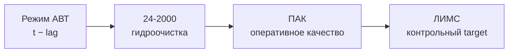

# ИСЛАМ

# ИСЛАМ — телеметрия АВТ

<aside>
✅

**Статус: первичный разбор завершён.** `avt_tags.csv` пригоден как регулярная история состояния АВТ и источник upstream-признаков. Но перед обучением модели обязательны флаги качества данных и выделение режимов: отсутствие пропусков не означает исправность сигналов.

</aside>

## Короткий вывод

АВТ — первая стадия цепочки **АВТ → гидроочистка 24-2000 → блендинг → товарное дизельное топливо**. Телеметрия АВТ показывает, в каком режиме установка формировала промежуточные фракции, которые позже поступают на гидроочистку. Поэтому данные АВТ нужны для объяснения и прогнозирования будущего качества с технологическим лагом.

При этом в файле нет:

- серы товарного дизеля;
- готовой разметки «норма / авария / останов»;
- правильных действий оператора;
- паспортных рабочих границ;
- явного разделения на измеряемые `STATE` и управляемые `CONTROL`.

Следовательно, **по одному файлу АВТ нельзя ни предсказать финальную серу, ни рекомендовать изменение режима**. `avt_tags.csv` нужно соединять по времени с телеметрией 24-2000, ПАК и ЛИМС.

## 1. Что находится в файле

| Характеристика | Результат |
| --- | --- |
| Период | 01.01.2023 00:00 — 07.08.2026 00:00 |
| Строк | 189 217 |
| Технологических сигналов | 71 |
| Шаг времени | ровно 10 минут |
| Пустые / нечисловые / бесконечные значения | не обнаружены |
| Повторы времени и обратный ход времени | не обнаружены |
| Часовой пояс | не указан |
| Семантика отсчёта | неизвестно: мгновенное значение или агрегация за 10 минут |

Все 71 сигнала сопоставлены с описаниями на листе «КИП». Однако в справочнике нет полного набора единиц измерения, допустимых диапазонов, признака `PV/SP`, статуса датчика и технологического лага.

## 2. Какую часть процесса описывают сигналы

### К-1 — подготовка и первичное разделение нефти

- `T1`, `T6` — температуры;
- `P2`, `P4` — давления;
- `F3`, `F5` — орошение и пар;
- `F7`, `F8`, `F9` — три потока обессоленной нефти;
- `D10` — канал плотности по справочнику.

### К-2 — наиболее важный upstream-блок для дизельных фракций

- состояние колонны: `T20`, `T33`, `P21`, `P22`, `P23`, `P67`;
- циркуляционные и острое орошения: `F12`, `F14`, `F19`, `F64`;
- пар: `F26`, `F27`, `F28`, `F29`;
- отборы фракций: `F30` 290–350 °C, `F32` 240–290 °C, `F34` 150–250 °C, `W70` массовый расход 290–350 °C;
- производительность К-2: `F65`;
- температура фракции 290–350 °C: `T71`.

Циркуляционное орошение — внутренний поток колонны, а не дополнительный выпуск продукта. Дизельные фракции АВТ — промежуточный продукт; это не то же самое, что товарный дизель после гидроочистки и блендинга.

### П-3 и К-10 — тяжёлая часть установки

Сюда относятся `F31`, `T55`, `T39`, `T48`, `T49`, `P44`, `P50`, `P51`, `P52`, циркуляционные потоки, тяжёлые фракции и гудрон. Для прогноза дизельного качества это скорее контекст всей установки; включать весь блок в первую модель необязательно.

## 3. Что обнаружено по качеству данных

<aside>
⚠️

В файле нет пустых ячеек, но есть длительные плато, отрицательные значения в каналах расхода и одинаковые целые числа одновременно на сигналах разных физических величин. Такие участки нельзя автоматически считать ни нормой, ни ошибкой.

</aside>

### Почти постоянный `D10`

Из 189 217 значений канала плотности:

- 189 207 значений равны `307` — около **99,995%**;
- 10 значений равны `240`;
- эти 10 отсчётов идут подряд 26.04.2024 с 10:40 до 12:10;
- в те же моменты сразу **37 из 71 сигналов** равны `240`.

Это сильный признак общего события в данных или выгрузке. Но считать `240` и `307` универсальными кодами ошибок пока нельзя: документированного словаря кодов нет.

### Примеры длинных плато

| Сигнал | Значение | Отсчётов подряд | Период |
| --- | --- | --- | --- |
| `F26` | 307 | 63 333 | 18.04.2024 12:50 — 02.07.2025 08:10 |
| `F3` | 251 | 3 544 | 21.03.2024 22:10 — 15.04.2024 12:40 |
| `T39` | 252 | 3 834 | 02.04.2023 13:50 — 29.04.2023 04:40 |
| `P22` | 240 | 2 542 | 19.06.2026 18:50 — 07.07.2026 10:20 |
| `P23` | 213 | 1 364 | 16.06.2026 08:10 — 25.06.2026 19:20 |

Для `F26` плато длится почти 440 суток. Подозрительность определяется не самим числом, а сочетанием длительности, физического смысла канала и синхронного появления на разных датчиках.

### Другие важные наблюдения

- `F5` («расход пара в К1») отрицателен примерно в **92,98%** строк; причина не установлена.
- У `F26` отрицательные значения и значение `307` вместе занимают около **99,83%** столбца.
- `P44` («вакуум низа К10») меняет характер представления: медианы до весны 2024 года положительные, после — преимущественно отрицательные. Это может быть сменой настройки или системы отсчёта, но подтверждения нет.
- В марте–апреле 2024 и июне 2026 несколько сигналов одновременно переходят в сильно отличающийся режим.
- Эти интервалы похожи на останов, пуск, смену режима или проблему измерений, но **без журнала событий нельзя назвать их подтверждёнными остановами или авариями**.
- Исторические min/max и квантили нельзя выдавать за безопасные технологические границы.

## 4. Можно ли автоматически выделить нормальную работу и остановы

**Частично да.** Можно автоматически выделить кандидатов на режимы:

1. стабильная работа;
2. переходный режим;
3. простой / малая загрузка;
4. подозрительное качество данных;
5. неизвестный аномальный режим.

Но это будет **алгоритмическая сегментация**, а не достоверная расшифровка событий. Для подтверждения классов нужны журнал остановов/пусков, ремонтов, переключений приборов или экспертная разметка технолога.

Для первой версии предлагается не удалять подозрительные строки, а добавить:

- `tag_flag_missing`;
- `tag_flag_stale`;
- `tag_flag_outlier`;
- `row_same_value_count`;
- `regime_id`;
- `regime_confidence`;
- `suspected_transition`;
- `source_quality_score`.

## 5. Как АВТ помогает решить общую задачу



Роль АВТ — объяснить, **какое сырьё и в каком режиме раньше пришло на следующую стадию**. Поэтому сигналы АВТ следует использовать с временными сдвигами, а не сопоставлять только «минута в минуту».

Первая feature table должна строиться вокруг реальной пробы ЛИМС:

```
timestamp_lims
target_sulfur_lims
avt_*_lag_30m / 1h / 2h / 4h / 6h
avt_*_rolling_mean / std / min / max
hydro_24_2000_*_lag
pak_sulfur_current
pak_age_minutes
data_quality_flags
regime_id
```

Стартовый набор АВТ для проверки связи:

| Группа | Кандидаты | Зачем |
| --- | --- | --- |
| Подача сырья | `F7`, `F8`, `F9`, `F65` | нагрузка и режим питания К-2 |
| Состояние К-2 | `T20`, `T33`, `P21`, `P22`, `P23`, `P67` | условия разделения |
| Пар и орошение | `F12`, `F14`, `F19`, `F29`, `F64` | режим работы колонны |
| Дизельные фракции | `F30`, `F32`, `W70`, `T71` | объём и состояние промежуточного потока |
| Контекст тяжёлой части | `F31`, `T55`, `P44` | общий режим установки; проверять как дополнительные признаки |

Это shortlist для исследования прогностической связи, **не перечень параметров, которые разрешено менять оператору**.

## 6. Что это меняет в мультиагентной системе

| Компонент | Как использует АВТ |
| --- | --- |
| Data Quality / Reliability | выставляет stale/outlier/режимные флаги и решает, можно ли доверять входу |
| QualityAgent | использует лаговые признаки АВТ вместе с 24-2000 и ПАК для прогноза ЛИМС |
| Candidate Generator | не меняет теги АВТ автоматически; работает только с подтверждёнными `CONTROL` |
| Safety | отклоняет действие при плохом качестве данных, выходе за ограничения или отсутствии надёжного прогноза |
| Optimizer | сравнивает только допустимые сценарии после прогноза и safety-check |

Критическое разделение:

- `STATE` — наблюдаемое состояние, например `T33`, `P21`, `F30`;
- `CONTROL` — подтверждённый оператором/технологом рычаг управления;
- `TARGET` — качество, которое прогнозируем, например сера ЛИМС;
- `LIMIT` — нормативные и технологические ограничения.

Нельзя превращать корреляцию вида «`T33` связан с серой» в совет «изменить `T33`». Тег может быть следствием других воздействий, а не доступным setpoint.

## 7. Что нужно уточнить у технолога

- [ ]  Единицы измерения и физические диапазоны shortlist-тегов.
- [ ]  Какие значения `240`, `251`, `252`, `307` являются кодами/заглушками, а какие могут быть реальными измерениями.
- [ ]  Какие теги — `PV`, какие — `SP`, какие соответствуют реально доступным воздействиям.
- [ ]  Есть ли журнал остановов, пусков, ремонтов и переключений приборов.
- [ ]  Одинаковы ли часовой пояс и правила формирования `date` в АВТ, 24-2000, ПАК и ЛИМС.
- [ ]  Каков физический путь дизельных фракций `F30/F32/W70` до точки контроля 24-2000.
- [ ]  Какой ориентировочный транспортный лаг между АВТ, 24-2000, ПАК и пробой ЛИМС.
- [ ]  Какая конкретно точка ЛИМС является target для товарной серы.

## 8. Ближайшие действия

1. Исключить два индексных столбца и нормализовать `date`, не интерполируя данные до проверки часового пояса.
2. Построить флаги flatline, синхронных кодоподобных значений, выбросов и смены режима.
3. Выделить кандидаты на рабочие и нерабочие интервалы; не называть их остановами без подтверждения.
4. Свести АВТ с 24-2000, ПАК и ЛИМС на общей временной шкале.
5. Проверить лаги 30 мин, 1, 2, 4 и 6 часов и rolling-признаки.
6. Сформировать первую таблицу «одна проба ЛИМС = одна target-строка».
7. Обучить простой baseline с временным split и сравнить:
    - только ПАК/24-2000;
    - ПАК/24-2000 + АВТ;
    - те же данные + Data Quality и regime-флаги.
8. Оставить в оптимизаторе только подтверждённые `CONTROL`; до этого выдавать прогноз/предупреждение, а не технологическое действие.

<aside>
🎯

**Итог:** АВТ закрывает левую часть общей модели — «что происходило раньше на первой стадии процесса». Практический следующий шаг не в разборе ещё одного тега, а в проверке, улучшает ли лаговая телеметрия АВТ прогноз лабораторной серы после объединения с 24-2000 и ПАК.

</aside>

## Источники

- `avt_tags.csv` — временной ряд телеметрии АВТ.
- `Теги_хакатон.xlsx`, лист «КИП» — расшифровка 71 тега АВТ и 26 тегов 24-2000.
- `АВТ_схемы.pdf` — технологическая топология К-1, К-2, П-3 и К-10.
- `ТЗ_нефтекод.docx` — назначение решения, ограничения и ожидаемый формат рекомендаций.
- Связанные исследования: [ПОЛИНА](%D0%9F%D0%9E%D0%9B%D0%98%D0%9D%D0%90%203d653f8f33c980fb8a41ca3cab49236e.md) и [ТИМОФЕЙ](%D0%A2%D0%98%D0%9C%D0%9E%D0%A4%D0%95%D0%99%203d653f8f33c980c08fcafd4a3916a891.md).