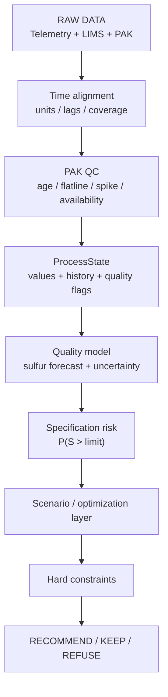

# ПОЛИНА

# ПОЛИНА — ПАК

<aside>
🎯

**Цель исследования:** понять, что именно дают данные ПАК 24-2000, насколько им можно доверять, как их использовать в ML и какое место они должны занимать в системе принятия решений.

</aside>

<aside>
⚠️

По ТЗ приоритет источников качества: **ЛИМС → ПАК → расчётные/виртуальные анализаторы**. Если источники расходятся, лабораторный результат — контрольный факт. ПАК может периодически выходить из строя.

</aside>

---

## 2. Что такое ПАК в этой задаче

ПАК — источник **оперативной оценки качества между редкими лабораторными анализами**. В выгрузке есть два сигнала:

| Сигнал | Смысл | Роль |
| --- | --- | --- |
| `Mg.Sulfur` | Оценка концентрации серы в топливе | Высокочастотная оперативная оценка качества |
| `D15` | Расчётная плотность топлива при 15 °C | Дополнительный технологический/качественный признак |

Важно: **10 мг/кг — это требование к товарному дизельному топливу, а не граница валидности ПАК.** Значение ПАК выше 10 мг/кг нельзя автоматически считать ошибкой или выбросом. Оно может отражать реальное состояние промежуточного продукта/режима. Ошибку оборудования надо определять по поведению сигнала и технологическому контексту.

---

# 3. Mg.Sulfur — характер данных

## Структура

| Параметр | Результат |
| --- | --- |
| Количество записей | **189 649** |
| Период | 01.01.2023 → 10.08.2026 |
| Шаг | **ровно 10 минут** |
| Дубликаты timestamp | 0 |
| Медиана | **8.37 ppm** |
| P05 / P95 | 5.65 / 10.99 ppm |
| min / max | 0.002 / 19.999 ppm |
| Доля значений > 10 мг/кг | около **12%** |

## Наблюдение 1 — распределение меняется во времени

Медиана и ширина диапазона заметно меняются по месяцам. Значит, ряд **нестационарный**: разные периоды работы установки имеют разные режимы и распределения качества.

**Следствие для ML:** случайное перемешивание строк нельзя использовать как основной train/test split. По ТЗ данные необходимо разделять **по времени**, чтобы будущие режимы не попадали в обучение модели, которая проверяется на прошлом.

## Наблюдение 2 — есть длинные зависания

Самый заметный эпизод:

> **16.03.2024 → 02.05.2024:** 6 732 одинаковых значения подряд, `7.70516 ppm` — примерно **46.8 дня**.
> 

Также обнаружены:

- около 18 дней на `7.88446 ppm` летом 2026;
- около 12 дней на `18.44615 ppm` в апреле 2026.

Около **6.5% всех точек Mg.Sulfur** входят в последовательности с неизменным значением продолжительностью ≥24 часов.

Это принципиально важно: timestamp продолжает обновляться, поэтому проверка только `pak_age` не обнаружит такую проблему.

**Вывод:** `данные поступают` ≠ `анализатор исправен`.

## Наблюдение 3 — есть резкие скачки

Максимальный найденный скачок между соседними 10-минутными измерениями — около **19.5 ppm за 10 минут**.

Сам по себе скачок нельзя автоматически считать ошибкой: он может быть следствием реального изменения режима. Но его нужно помечать как подозрительный и проверять по другим технологическим сигналам.

## Что считать аномалией

Для ПАК аномалия — не просто "слишком высокая сера". Полезнее разделять типы проблем:

- `STALE` — новое измерение не пришло вовремя;
- `FLATLINE` — timestamp меняется, значение слишком долго одинаковое;
- `SPIKE` — нетипично резкое изменение между соседними точками;
- `OUT_OF_RANGE` — значение вне подтверждённого физического/технологического диапазона;
- `OK` — явных проблем качества сигнала нет;
- `UNKNOWN` — недостаточно информации для уверенной оценки.

Пороги для `FLATLINE`, `SPIKE`, `OUT_OF_RANGE` нельзя окончательно задавать только статистикой. Их нужно согласовать с технологическим смыслом и/или проверить по ЛИМС и телеметрии.

---

# 4. D15 — характер данных

## Структура

| Параметр | Результат |
| --- | --- |
| Количество записей | **75 455** |
| Период | 05.03.2025 → 11.08.2026 |
| Шаг | практически 10 минут |
| Дубликаты timestamp | 0 |
| Медиана | **835.23 кг/м³** |
| P05 / P95 | 832.64 / 839.25 кг/м³ |
| min / max | 810.92 / 852.75 кг/м³ |

Временной ряд D15 существенно короче Mg.Sulfur: он начинается только в марте 2025 года. Следовательно, при совместном использовании двух сигналов фактический общий период обучения сокращается.

## Наблюдение 4 — D15 также меняет режимы

Медиана и диапазон D15 меняются во времени. Плотность нельзя считать постоянным фоном: это самостоятельный сигнал состояния продукта/процесса.

## Зависания D15

Длительных многодневных flatline, аналогичных Mg.Sulfur, не найдено. Самый длинный период строго неизменного значения — около **18.5 часа** (`837.2482 кг/м³`).

Это не доказывает неисправность: для D15 реальная стабильность процесса может быть нормальной. Поэтому правила качества для Mg.Sulfur и D15 должны быть **разными**, даже если технический детектор реализован одинаково.

## Резкие изменения D15

Максимальный скачок между соседними точками — около **13.86 кг/м³ за 10 минут**. Такие эпизоды тоже нужно маркировать, но не удалять автоматически до проверки технологического контекста.

---

# 5. Связь Mg.Sulfur и D15

На совпадающем временном интервале проверена простая связь между двумя сигналами.

| Метрика | Значение | Интерпретация |
| --- | --- | --- |
| Pearson | `r = 0.23` | слабая линейная связь |
| Spearman | `ρ = 0.11` | очень слабая монотонная связь |
| Корреляция изменений | `corr(ΔS, ΔD) ≈ -0.01` | совместной краткосрочной динамики практически нет |

**Вывод:** устойчивой простой зависимости `D15 → sulfur` в этих данных не обнаружено. Плотность сама по себе не объясняет содержание серы и не может быть простым proxy для проверки Mg.Sulfur.

При этом D15 **не нужно выбрасывать из ML-признаков**. Низкая попарная корреляция не означает, что признак бесполезен во взаимодействии с температурами, давлениями, расходами, режимами и временными лагами.

---

# 5.1. Связка ПАК ↔ ЛИМС: что удалось подтвердить

После отдельного сопоставления ПАК с лабораторными измерениями часть прежних гипотез можно заменить на факты.

## Какая лабораторная точка сопоставлялась

Для сравнения использовалась точка ЛИМС по продукту дизельного топлива после гидроочистки, где есть те же показатели качества:

```
Mg.Sulfur
D15
```

Она соответствует тому же технологическому продукту/участку, что и ПАК 24-2000. При этом пока **не подтверждено**, что место отбора лабораторной пробы и место установки ПАК физически совпадают до метра — это стоит уточнить у технолога.

## Частота ЛИМС и ПАК

Для `Mg.Sulfur` в ЛИМС найдено **1462 лабораторных анализа**. Основная часть измерений регулярная: **1177 анализов выполнены в 10:00**, медианный интервал между анализами — **24 часа**.

ПАК `Mg.Sulfur` измеряет каждые **10 минут** и содержит 189 649 точек.

Получается чёткое разделение ролей:

> **ЛИМС = редкий контрольный факт.**
> 

> **ПАК = оперативная оценка между лабораторными анализами.**
> 

Это соответствует ТЗ: приоритет источников качества — `ЛИМС → ПАК → расчётные/виртуальные анализаторы`.

## Длинные flatline Mg.Sulfur действительно невалидны

Ранее по самому ПАК был найден эпизод:

> **16.03.2024 → 02.05.2024:** ПАК держал `7.70516 ppm` около 46.8 дня.
> 

Сопоставление с ЛИМС показывает, что в этот же период лабораторная сера заметно менялась. Например, 23.04.2024 ЛИМС фиксировал значения `34`, `107`, `6.8`, `5.0 мг/кг`, в то время как ПАК продолжал показывать `7.705`.

Следовательно, это уже не просто статистически подозрительный участок:

<aside>
✅

**Длинный flatline Mg.Sulfur может означать замороженный/невалидный сигнал ПАК даже при формально свежем timestamp.**

</aside>

Аналогичное расхождение найдено летом 2026 года: ПАК длительно держался около `7.884`, в то время как ЛИМС менялся в широком диапазоне.

Для зависания на `18.446 ppm` в апреле 2026 лабораторных точек на соответствующем участке недостаточно, поэтому его корректнее пока называть **подозрительным flatline**, а не доказанной неисправностью.

## Насколько Mg.Sulfur ПАК совпадает с ЛИМС

Для стандартных лабораторных проб около 10:00 и ближайших по времени значений ПАК получено примерно:

| Метрика | Без сдвига | Лучшее найденное простое смещение |
| --- | --- | --- |
| Корреляция Pearson | ≈ **0.30** | ≈ **0.42** |
| MAE | ≈ **1.46 мг/кг** | ≈ **1.33 мг/кг** |
| Сдвиг | 0 | ПАК примерно за **50 минут до ЛИМС** |

Это означает, что `Mg.Sulfur(PAK)` **не является прямой заменой лабораторной серы**.

Найденное смещение около 50 минут пока нельзя объявлять технологическим лагом. Оно может складываться из времени движения продукта, места установки анализатора, процедуры отбора пробы и времени фиксации результата. Нужна технологическая проверка.

## Порог 10 мг/кг ПАК ловит не всегда

Если использовать ЛИМС как контрольный факт и спрашивать, совпадает ли ПАК с событием `S > 10 мг/кг`, то ПАК обнаруживает лишь около **25–28%** лабораторных превышений в проверенных вариантах временного сопоставления.

При этом, когда ЛИМС показывает `S ≤ 10`, ПАК в большинстве случаев тоже остаётся ниже порога — специфичность порядка **91–92%**.

То есть ПАК хорошо работает как оперативный сигнал, но **не должен самостоятельно принимать решение о соответствии продукта требованиям**.

## D15 ведёт себя иначе

Для D15 найдено **263 сопоставимых лабораторных измерения** на общем временном интервале.

Результат значительно лучше:

| Метрика | Результат |
| --- | --- |
| Pearson | ≈ **0.95** |
| MAE | ≈ **0.75 кг/м³** |
| Median absolute error | ≈ **0.47 кг/м³** |
| Bias `PAK - LIMS` | ≈ **-0.44 кг/м³** |

<aside>
✅

**D15 ПАК хорошо согласуется с лабораторным D15 на доступном общем интервале.** В отличие от Mg.Sulfur, этот сигнал можно считать существенно более надёжным online-приближением лабораторного показателя.

</aside>

## Что это меняет в роли ПАК

```
PAK Mg.Sulfur
→ полезный high-frequency сигнал
→ не ground truth
→ обязательно учитывать quality flags
→ длинные flatline подтверждены как реальная проблема
→ нельзя использовать самостоятельно для решения S > 10

PAK D15
→ надёжный high-frequency признак
→ хорошо согласуется с лабораторным D15
→ может использоваться как полноценный вход состояния процесса
```

Главный вывод связки ЛИМС + ПАК:

> **Разные показатели одного и того же ПАК имеют разную надёжность. Поэтому нельзя назначить один общий уровень доверия всему источнику ПАК — качество нужно оценивать по каждому сигналу отдельно.**
> 

---

# 6. Как ПАК должен попадать в общее состояние

## Главная мысль

По ТЗ контрольный источник качества — **ЛИМС**.

## Что является одной строкой обучающего датасета

Для модели, ориентированной на лабораторную истину, одна обучающая запись должна соответствовать **моменту лабораторного анализа**, а не каждой 10-минутной строке ПАК.

К моменту ЛИМС собирается только информация, доступная к этому времени. Это логичнее срабатывания каждые 10 минут, потому что набор данных описывает **динамическое состояние процесса**. Для технологического процесса это значительно информативнее одного значения.

---

# 7. Нужна ли разметка ПАК

Для каждого сигнала стоит автоматически сформировать признаки качества:

```
pak_available
pak_timestamp
pak_age
pak_quality
pak_suspected_failure
flatline_minutes
delta_10m
```

Возможная категориальная разметка:

```
OK
FLATLINE
STALE
SPIKE
OUT_OF_RANGE
UNKNOWN
```

### Как размечать

1. Статистические правила находят **кандидатов** на аномалии.
2. Самые длинные/резкие эпизоды проверяются по телеметрии и ЛИМС.
3. Несколько десятков характерных эпизодов полезно показать технологу и уточнить правила.
4. После этого правила применяются автоматически ко всему массиву.

<aside>
💡

Не удалять подозрительные строки без следа. Лучше хранить исходное значение + `quality flag`, чтобы модель и система могли понимать причину снижения доверия.

</aside>

---

# 9. Какую задачу должна решать модель качества

## Основная ML-задача

**Regression / soft sensor:** прогноз численного содержания серы.

Предпочтительный target:

```
sulfur по ЛИМС в выбранной контрольной точке
```

или, если строим прогноз с лагом:

```
sulfur по ЛИМС в момент t + Δt
```

где `Δt` — технологически обоснованный лаг между изменением режима и откликом качества.

## Дополнительный выход

Из численного прогноза можно получать:

```
P(S > 10 мг/кг)
```

Но бинарная классификация `≤10 / >10` не должна заменять регрессию: она теряет разницу между 2 и 9.9 мг/кг, а также между 10.1 и 19 мг/кг.

## Необходимый выход модели

```
predicted_sulfur
prediction_interval / uncertainty
risk_of_spec_violation
input_data_quality
```

---

# 10. Роль ПАК во всей архитектуре

Предлагаемая архитектура в [Архитектура и план разработки МАС (первый взгляд)](../%D0%90%D1%80%D1%85%D0%B8%D1%82%D0%B5%D0%BA%D1%82%D1%83%D1%80%D0%B0%20%D0%B8%20%D0%BF%D0%BB%D0%B0%D0%BD%20%D1%80%D0%B0%D0%B7%D1%80%D0%B0%D0%B1%D0%BE%D1%82%D0%BA%D0%B8%20%D0%9C%D0%90%D0%A1%20(%D0%BF%D0%B5%D1%80%D0%B2%D1%8B%D0%B9%20%D0%B2%D0%B7%D0%B3%D0%BB%D1%8F%D0%B4)%203d653f8f33c980be9b51c6476299d774.md) в целом правильно ставит `Telemetry + LIMS + PAK` перед общим `Data Pipeline`, но после EDA ПАК нужно сделать более явным участником слоя качества данных.



## Что ПАК даёт каждому слою

| Слой | Роль ПАК |
| --- | --- |
| Data Pipeline | оперативные сигналы качества + отдельный QC/аномалии |
| ProcessState | последнее значение, история, возраст, доступность, quality flags |
| Quality model | важный динамический признак; при необходимости proxy-target для high-frequency soft sensor |
| Uncertainty | flatline/stale/spike должны снижать доверие к прогнозу |
| Optimizer | не используется как независимая истина; получает прогноз модели качества |
| Orchestrator | учитывает качество ПАК при решении `RECOMMEND / KEEP / REFUSE` |

---

# 11. Что стоит изменить в текущей архитектурной гипотезе

### 1. Не считать ПАК target'ом по умолчанию

Основная истина по ТЗ — ЛИМС. ПАК — оперативный, но потенциально неисправный источник.

### 2. Вынести PAK Quality Control в явный слой

Текущего `pak_age_minutes` недостаточно: 47-дневный flatline имеет формально свежие timestamp. Нужны как минимум `flatline_duration`, `spike flag`, `quality state`.

### 3. Не начинать сравнение моделей с Transformer/LSTM

Для первого валидного baseline логичнее начать с **naive baseline + CatBoost/LightGBM на лаговых/rolling-признаках**, а сложные sequence-модели добавлять после доказательства, что baseline недостаточен и данных хватает.

### 4. `QualityAgent.predict(state, action)` требует осторожности

Исторические наблюдения показывают связи, но не автоматически доказывают причинный эффект управляющего воздействия. Пока не доказано, что модель адекватно оценивает последствия изменения action, оптимизатор не должен выдавать контрфактический прогноз как установленный факт.

На первом прототипе безопаснее разделить:

```
forecast(state) → что будет при текущем режиме
scenario(state, candidate_action) → экспериментальная оценка, только в валидированном диапазоне
```

### 5. Риск `S > 10` — производный слой

Сначала полезнее получить численный прогноз серы + uncertainty, а затем из него оценивать риск нарушения спецификации.

---

# 12. Предлагаемый контракт ПАК в ProcessState

```python
class PakSignalState(BaseModel):
    value: float | None
    timestamp: datetime | None
    age_minutes: float | None
    available: bool

    quality: Literal[
        "OK",
        "STALE",
        "FLATLINE",
        "SPIKE",
        "OUT_OF_RANGE",
        "UNKNOWN",
    ]
    suspected_failure: bool

    flatline_minutes: float | None
    delta_10m: float | None
    mean_1h: float | None
    std_1h: float | None
    trend_1h: float | None

class ProcessState(BaseModel):
    timestamp: datetime

    pak_sulfur: PakSignalState
    pak_d15: PakSignalState

    latest_lims_sulfur: float | None
    lims_timestamp: datetime | None
    lims_age_hours: float | None

    # далее — телеметрия АВТ и 24-2000
```

`PakSignalState` можно использовать и для других ПАК-сигналов, но правила QC должны задаваться отдельно для каждого показателя.

---

# 13. Что мы уже можем утверждать

<aside>
✅

**1. Mg.Sulfur — качественный по частоте, но не по надёжности источник:** 10-минутный регулярный ряд содержит многодневные зависания.

</aside>

<aside>
✅

**2. D15 — самостоятельный дополнительный сигнал:** простая связь с серой слабая, но это не исключает его полезности вместе с телеметрией и временными признаками.

</aside>

<aside>
✅

**3. ПАК должен входить в модель вместе с метаданными доверия:** значение без `age / quality / flatline / spike` недостаточно безопасно для системы рекомендаций.

</aside>

<aside>
✅

**4. ПАК не является первым источником истины:** окончательная валидация качества должна идти через ЛИМС.

</aside>

---

# 14. Что пока неизвестно и нужно выяснить дальше

- [ ]  Какая конкретно лабораторная точка ЛИМС соответствует целевому качеству для выбранного сценария?
- [ ]  Сколько валидных анализов серы ЛИМС есть на общем интервале с телеметрией?
- [ ]  Насколько `Mg.Sulfur(PAK)` совпадает с ЛИМС в нормальных периодах?
- [ ]  Что происходит с расхождением `LIMS - PAK` во время flatline/spike?
- [ ]  Какой физический лаг между изменением режимных параметров и изменением качества продукта?
- [ ]  Какие технологические параметры 24-2000 являются действительно управляемыми, а какие только наблюдаемыми?
- [ ]  Какие рабочие диапазоны подтверждены технологическими материалами, а какие можно использовать только как модельные допущения?
- [ ]  Какие остановы/смены режима нужно исключать или маркировать отдельно?

## Следующий шаг

**Свести по времени ЛИМС + ПАК + телеметрию 24-2000/АВТ и перейти от исследования отдельных источников к исследованию связи:**

```
режим процесса → технологический лаг → качество по ПАК → контроль по ЛИМС
```

После этого можно окончательно зафиксировать target, горизонт прогноза, feature table и baseline модели.