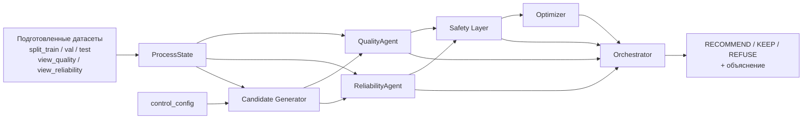
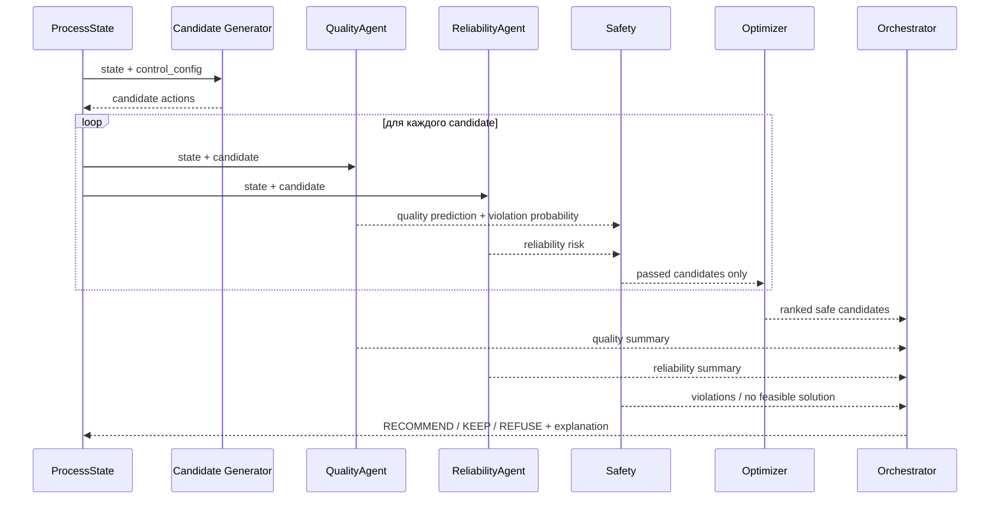

# Распределение и разработка

<aside>
🏗️

**Фиксируем архитектуру для разработки.** Подготовленные датасеты `view_quality.csv`, `view_reliability.csv`, `view_orchestrator.csv`, `split_train.csv`, `split_val.csv`, `split_test.csv` принимаем как корректный входной слой и **не тратим текущую итерацию на повторную валидацию их построения**.

Основная МАС состоит из **трёх агентов: QualityAgent, ReliabilityAgent и Orchestrator**. Candidate Generator, Safety Layer и Optimizer — отдельные детерминированные/алгоритмические компоненты, а не самостоятельные LLM-агенты.

</aside>

# Архитектура системы



## Что является агентом, а что нет

| Компонент | Тип | Задача |
| --- | --- | --- |
| **QualityAgent** | агент / ML-компонент | прогнозирует качество продукта и вероятность нарушения спецификации для текущего состояния и candidate action |
| **ReliabilityAgent** | агент / ML + rule-based | оценивает тяжесть режима, data quality, близость к ограничениям и технологический риск |
| **Orchestrator** | агент | собирает результаты остальных компонентов, выбирает финальный статус и формирует объяснимый ответ оператору |
| Candidate Generator | алгоритмический модуль | генерирует допустимые изменения только подтверждённых `CONTROL`-параметров |
| Safety Layer | детерминированный фильтр | жёстко отбрасывает candidate actions, нарушающие LIMIT / model bounds |
| Optimizer | алгоритмический модуль | ранжирует только безопасные сценарии и выбирает лучший вариант |

<aside>
📌

**Важный архитектурный принцип:** Orchestrator не должен сам заново интерпретировать сотни сырых тегов и решать, «хорошее» ли значение серы. Он получает уже рассчитанные `quality_prediction`, `violation_probability`, `data_confidence`, `reliability_risk`, `constraint_passed`, `violations` и результат ranking.

</aside>

---

# Поток данных

## 1. Подготовленный вход

Принимаем существующие файлы как готовый data layer:

```
split_train.csv
split_val.csv
split_test.csv
    ↓
обучение / валидация моделей

view_quality.csv
view_reliability.csv
    ↓
online ProcessState

view_orchestrator.csv
    ↓
агрегированный срез / основа для финального ответа
```

### `view_quality.csv`

Вход QualityAgent:

```
timestamp
<indicator>_value
<indicator>_age_min
<indicator>_src
<indicator>_flag_missing
<indicator>_flag_stale
<indicator>_flag_outlier
```

Что агент должен понимать из него:

- текущее доступное качество;
- источник измерения;
- возраст измерения;
- доверие к данным;
- признаки серы, D15, flash point, T95 и других показателей.

### `view_reliability.csv`

Вход ReliabilityAgent:

```
timestamp
avt_*
hyd_*
<tag>_flag_missing
<tag>_flag_stale
<tag>_flag_outlier
```

Что агент должен оценить:

- текущий режим АВТ;
- текущий режим гидроочистки 24-2000;
- тяжесть режима;
- необычные / рискованные состояния;
- data confidence;
- последствия candidate action для надёжности.

---

# Агент качества — QualityAgent

## Назначение

QualityAgent отвечает на вопрос:

> **«Что произойдёт с качеством продукта, если оставить текущий режим или изменить CONTROL-параметры определённым образом?»**
> 

## Вход

```
ProcessState
+
Candidate Action
+
view_quality features
+
режимные признаки АВТ / 24-2000
```

Для обучения используем готовые `split_train / split_val / split_test`.

## Основной target MVP

**Сера**:

```
Sulfur forecast
P(Sulfur > 10 мг/кг)
```

После MVP тем же контрактом можно добавлять:

- T95;
- FlashPoint;
- D15;
- другие показатели из quality-view.

## Выход QualityAgent

Минимальный контракт:

```json
{
  "quality_prediction": 8.8,
  "prediction_lower": 8.2,
  "prediction_upper": 9.5,
  "violation_probability": 0.09,
  "data_confidence": "HIGH"
}
```

Для первой версии interval может быть опциональным; обязательны prediction, вероятность нарушения и confidence.

## Что НЕ делает QualityAgent

- не выбирает окончательную рекомендацию;
- не проверяет весь технологический safety-контур;
- не решает, какой CONTROL можно физически менять;
- не ранжирует сценарии по общей полезности.

---

# Агент надёжности — ReliabilityAgent

## Назначение

ReliabilityAgent отвечает на вопрос:

> **«Насколько текущий или предлагаемый режим тяжёлый / рискованный для процесса и оборудования?»**
> 

## Вход

Основной источник — `view_reliability.csv`:

```
AVT telemetry
+
24-2000 telemetry
+
missing / stale / outlier flags
+
Candidate Action
```

## Логика

ReliabilityAgent оценивает:

- близость к технологическим/model bounds;
- аномальность режима;
- риск выхода за нормальную область модели;
- качество и достаточность входных данных;
- насколько candidate action ухудшает или улучшает тяжесть режима.

## Выход ReliabilityAgent

Минимальный контракт:

```json
{
  "reliability_risk": "LOW",
  "risk_score": 0.18,
  "data_confidence": "HIGH",
  "warnings": []
}
```

## Что НЕ делает ReliabilityAgent

- не прогнозирует лабораторную серу вместо QualityAgent;
- не выбирает финальную рекомендацию;
- не изменяет CONTROL самостоятельно;
- не подменяет Safety Layer.

---

# Candidate Generator + control_config

Candidate Generator получает `ProcessState` и **отдельный `control_config`**.

```yaml
controls:
  <tag>:
    min: ...
    max: ...
    step: ...
    max_delta: ...
    unit: ...
```

Он генерирует только физически допустимые изменения.

Например:

```
CURRENT:
control_A = 10
control_B = 20

CANDIDATES:
A: control_A + step
B: control_A - step
C: control_B + step
D: control_A + step + control_B - step
```

<aside>
🛑

**Optimizer не получает права менять любой `avt_*` или `hyd_*` тег.** Все теги — STATE по умолчанию. Изменять можно только параметры, явно включённые в `control_config` как CONTROL.

</aside>

---

# Safety Layer

Safety — отдельный детерминированный слой между прогнозом и оптимизацией.

Для каждого candidate action выполняется:

```
ProcessState + Candidate Action
        ↓
QualityAgent + ReliabilityAgent
        ↓
Safety Layer
```

Safety проверяет:

- жёсткие ограничения качества;
- технологические ограничения;
- model bounds;
- confidence моделей;
- наличие критических входов.

Для серы:

```
если прогноз S > 10 мг/кг
→ candidate отклоняется
```

При наличии uncertainty можно использовать `prediction_upper` или `P(S > 10)`.

Выход:

```json
{
  "constraint_passed": true,
  "violations": []
}
```

или

```json
{
  "constraint_passed": false,
  "violations": ["SULFUR_LIMIT"]
}
```

---

# Optimizer

Optimizer получает **только сценарии, прошедшие Safety**.

Он не прогнозирует процесс сам, а сравнивает уже оценённые варианты:

```
candidate
+
quality prediction
+
reliability risk
+
constraints
+
production / economic proxy
```

На MVP ranking можно сделать прозрачной формулой, например:

```
score =
  качество
  - reliability_penalty
  + production_gain
  - size_of_control_change
```

Конкретные веса фиксируем отдельно и делаем объяснимыми.

Если после Safety кандидатов нет:

```
NO_FEASIBLE_SOLUTION
```

---

# Orchestrator

## Назначение

Orchestrator отвечает не на технологический под-вопрос, а за **финальное решение системы**.

Он получает:

```
current ProcessState
QualityAgent results
ReliabilityAgent results
Safety results
Optimizer ranking
```

и возвращает один из трёх исходов:

```
RECOMMEND
KEEP
REFUSE
```

### RECOMMEND

Есть безопасный candidate, который лучше текущего режима.

### KEEP

Текущий режим приемлем, а изменение не даёт достаточно убедительного выигрыша.

### REFUSE

Система не должна давать рекомендацию, например когда:

- нет допустимых candidate actions;
- QualityAgent не способен выдать надёжный прогноз;
- data confidence недостаточен для безопасного решения;
- все варианты отброшены Safety.

## Финальный контракт ответа

```json
{
  "decision": "RECOMMEND",
  "current_state": {
    "sulfur": 9.7,
    "violation_probability": 0.41
  },
  "recommendation": {
    "changes": {
      "control_A": "+0.8",
      "control_B": "+1.0"
    },
    "expected_sulfur": 8.8,
    "expected_violation_probability": 0.09,
    "reliability_risk": "LOW"
  },
  "explanation": "..."
}
```

---

# Фиксированная последовательность вызовов



---

# Распределение команды

Фиксируем ownership так, чтобы у каждого был самостоятельный компонент и минимально пересекалась реализация.

| Человек | Компонент | Почему логично | Основной результат |
| --- | --- | --- | --- |
| **Никита** | **QualityAgent** | разбирал ЛИМС и ground truth качества | модель серы + risk classifier + API/contract QualityAgent |
| **Ислам** | **ReliabilityAgent** | разбирал телеметрию АВТ и качество режимных сигналов | risk/data-confidence logic + API/contract ReliabilityAgent |
| **Гера** | **Candidate Generator + Safety + Optimizer** | разбирал 24-2000, участок наиболее близкий к управляющим воздействиям на серу | `control_config`, генерация candidate actions, safety-фильтр, ranking |
| **Полина** | **Orchestrator + интеграция МАС** | разбирала ПАК и оперативный quality-layer; здесь сходятся контракты всех компонентов | end-to-end pipeline, финальный decision contract, объяснение, demo-сценарии |

---

# Задачи по людям

## Гера — QualityAgent

- [ ]  Зафиксировать список входных колонок из `split_*` для модели серы.
- [ ]  Обучить baseline regression для sulfur.
- [ ]  Обучить classifier `P(S > 10)`.
- [ ]  Посчитать метрики на `val/test`.
- [ ]  Реализовать `predict(state, candidate)`.
- [ ]  Возвращать `quality_prediction`, `violation_probability`, `data_confidence`.
- [ ]  Подготовить пример ответа агента для normal / risky режима.

**Definition of Done:** по одному `state + candidate` агент возвращает стабильный JSON-контракт, который можно передать в Safety.

### Входы и выходы по этапам

| Этап | Вход — вид / тип | Выход — вид / тип |
| --- | --- | --- |
| Зафиксировать колонки `split_*` | `split_train.csv`, `split_val.csv`, `split_test.csv` — **табличные данные / CSV → pandas.DataFrame**; признаки — числовые/категориальные колонки, target sulfur — `float` | Схема признаков — **конфиг / `list[str]`  • JSON/YAML**: `feature_columns`, `target_column`, optional categorical columns |
| Baseline regression sulfur | `X_train: DataFrame`, `y_train: Series[float]` | Обученная regression-модель — **model artifact** (`CatBoostRegressor`/аналог, `.cbm`/`.pkl`) + metadata модели |
| Classifier `P(S > 10)` | `X_train: DataFrame`, `y_risk: Series[bool|int]`, где `1 = sulfur > 10` | Обученный classifier — **model artifact**; inference-выход — `float` probability в диапазоне `[0,1]` |
| Метрики `val/test` | Модели + `X_val/X_test`, `y_val/y_test` — **DataFrame/Series** | Отчёт метрик — **JSON/таблица**: regression (`MAE`, `RMSE`, при необходимости `R²`), classifier (`ROC-AUC`/`PR-AUC`, `Recall`, `F1`, calibration/Brier — по выбранному набору) |
| `predict(state, candidate)` | `state: ProcessState` — **JSON/Pydantic object**; `candidate: CandidateAction | null` — **JSON/Pydantic object** | `QualityAssessment` — **JSON/Pydantic object** |
| Стабильный контракт ответа | Результаты regression/classifier + freshness/quality flags | `quality_prediction: float|null`, `prediction_lower/upper: float|null`, `violation_probability: float|null`, `data_confidence: float|enum`, optional `warnings: list[str]` |
| Примеры normal / risky | 2 зафиксированных `state + candidate` — **JSON fixtures** | 2 эталонных ответа `QualityAssessment` — **JSON examples** для интеграционных тестов и демо |

## Ислам — ReliabilityAgent

- [ ]  Зафиксировать входные признаки из `view_reliability.csv`.
- [ ]  Определить rule-based проверки `missing/stale/outlier/model bounds`.
- [ ]  Сделать интегральный `risk_score` / risk category.
- [ ]  Реализовать сравнение `current state` и `state + candidate`.
- [ ]  Возвращать `reliability_risk`, `risk_score`, `data_confidence`, `warnings`.
- [ ]  Подготовить 2–3 примера тяжёлого / подозрительного режима.

**Definition of Done:** компонент одинаковым контрактом оценивает текущий и candidate-режим и может объяснить, какие факторы повысили риск.

### Входы и выходы по этапам

| Этап | Вход — вид / тип | Выход — вид / тип |
| --- | --- | --- |
| Зафиксировать признаки `view_reliability.csv` | `view_reliability.csv` — **табличные данные / CSV → pandas.DataFrame**: `timestamp`, `avt_*`, `hyd_*`, `*_flag_missing`, `*_flag_stale`, `*_flag_outlier` | Схема reliability-признаков — **JSON/YAML + `list[str]`**, отдельно `feature_columns`, `quality_flag_columns`, `critical_inputs` |
| Rule-based проверки | `ProcessState`/строка telemetry + model/technology bounds — **JSON/Pydantic + config** | `RuleCheckResult` — **JSON**: `missing_flags: list[str]`, `stale_flags: list[str]`, `outlier_flags: list[str]`, `bound_violations: list[str]` |
| Интегральный `risk_score` | Rule-check results + расстояния до bounds + anomaly/model-domain признаки — **числовой feature vector / dict** | `risk_score: float`  • `reliability_risk: enum` (`LOW/MEDIUM/HIGH` либо выбранная шкала) |
| Сравнение current vs candidate | `current_state: ProcessState`, `candidate_state: ProcessState` либо `ProcessState + CandidateAction` | `RiskComparison` — **JSON**: `current_risk`, `candidate_risk`, `risk_delta`, `drivers: list[str]` |
| Стабильный контракт ответа | Итоги rules + risk model/scoring + data quality | `ReliabilityAssessment` — **JSON/Pydantic**: `reliability_risk`, `risk_score`, `data_confidence`, `warnings`, optional `risk_factors` |
| Тяжёлые / подозрительные режимы | 2–3 выбранных timestamp/state — **JSON fixtures / строки DataFrame** | 2–3 эталонных `ReliabilityAssessment`  • объяснение факторов риска — **JSON examples** |

## Никита — Candidate Generator / Safety / Optimizer

- [ ]  Создать `control_config`.
- [ ]  Зафиксировать первые CONTROL для MVP.
- [ ]  Реализовать перебор candidate actions с `step` / `max_delta`.
- [ ]  Реализовать Safety по hard constraints.
- [ ]  Обрабатывать `P(S > 10)` / uncertainty.
- [ ]  Сделать прозрачный ranking прошедших Safety кандидатов.
- [ ]  Реализовать `NO_FEASIBLE_SOLUTION`.

**Definition of Done:** из текущего ProcessState генерируется набор кандидатов, каждый проходит прогноз и Safety, после чего возвращается ranked shortlist или отсутствие допустимого решения.

### Входы и выходы по этапам

| Этап | Вход — вид / тип | Выход — вид / тип |
| --- | --- | --- |
| Создать `control_config` | Подтверждённые CONTROL-параметры и границы — **ручная/документная конфигурация** | `control_config.yaml|json` — **config**: для каждого control `min: float`, `max: float`, `step: float`, `max_delta: float`, `unit: str` |
| Зафиксировать CONTROL для MVP | `control_config`  • выбранный сценарий MVP | `controls: dict[str, ControlSpec]` / фиксированный whitelist изменяемых тегов |
| Генерация candidate actions | `ProcessState`  • `control_config` — **JSON/Pydantic + config** | `list[CandidateAction]` — **JSON array**; каждый candidate содержит `changes: dict[tag, float]`, `candidate_id`, optional `delta` |
| Safety hard constraints | `CandidateAction`  • `QualityAssessment`  • `ReliabilityAssessment`  • `limits/model_bounds` | `SafetyResult` — **JSON/Pydantic**: `constraint_passed: bool`, `violations: list[str]`, optional `rejection_reason` |
| Обработка `P(S > 10)` / uncertainty | `violation_probability: float`, `prediction_upper: float|null`, `data_confidence` | Safety-флаги — **bool/list**: например `SULFUR_LIMIT`, `LOW_CONFIDENCE`, `OUT_OF_MODEL_DOMAIN`; candidate либо проходит, либо отбрасывается |
| Прозрачный ranking | Только `constraint_passed=true` candidates + quality/reliability metrics + production/economic proxy — **list[ScoredCandidateInput]** | `ranked_candidates: list[RankedCandidate]` — **JSON array**, поля `rank: int`, `score: float`, `score_components: dict`, `candidate` |
| `NO_FEASIBLE_SOLUTION` | Пустой список кандидатов после Safety либо все candidates отклонены | `OptimizationResult` — **JSON**: `status: "NO_FEASIBLE_SOLUTION"`, `ranked_candidates: []`, `reasons: list[str]` |

## Полина — Orchestrator / интеграция

- [ ]  Зафиксировать общий `ProcessState` contract.
- [ ]  Зафиксировать интерфейсы между всеми компонентами.
- [ ]  Собрать pipeline вызовов end-to-end.
- [ ]  Реализовать `RECOMMEND / KEEP / REFUSE`.
- [ ]  Реализовать финальное объяснение для оператора.
- [ ]  Проверить обработку ошибок / неполных ответов агентов.
- [ ]  Собрать 3 demo-сценария для защиты.

**Definition of Done:** один входной timestamp / state проходит через всю МАС и даёт единый объяснимый ответ системы.

### Входы и выходы по этапам

| Этап | Вход — вид / тип | Выход — вид / тип |
| --- | --- | --- |
| Общий `ProcessState` contract | Один `timestamp`  • соответствующие строки/срезы `view_quality` и `view_reliability` — **datetime + DataFrame rows** | `ProcessState` — **Pydantic/JSON object**: `timestamp: datetime`, `quality: dict`, `telemetry: dict`, `data_quality: dict`, optional `current_controls: dict` |
| Интерфейсы компонентов | Контракты `ProcessState`, `CandidateAction`, `QualityAssessment`, `ReliabilityAssessment`, `SafetyResult`, `OptimizationResult` | Единые **Pydantic models / JSON Schema**  • правила обязательных/optional полей |
| End-to-end pipeline | `timestamp | ProcessState` — **datetime или JSON/Pydantic** | `ExecutionTrace` — **структурированный JSON/log**: generated candidates → agent assessments → Safety → ranking → final decision |
| `RECOMMEND / KEEP / REFUSE` | Current assessments + `OptimizationResult`  • Safety status + confidence | `decision: enum` (`RECOMMEND`, `KEEP`, `REFUSE`) + `decision_reason: str|list[str]` |
| Объяснение оператору | Выбранный candidate или причина отказа + quality/reliability/safety facts | `OperatorResponse` — **JSON + human-readable text**: текущее состояние, проблема/риск, действие, ожидаемый эффект, ограничения, уверенность, объяснение |
| Ошибки / неполные ответы агентов | Timeout/exception, missing required fields, low confidence, invalid schema — **exception/status + partial JSON** | `PipelineError|FallbackDecision` — **JSON**; безопасный fallback обычно `REFUSE`, с `error_code`, `component`, `message`, без рискованной рекомендации |
| 3 demo-сценария | Зафиксированные timestamp/state: normal, risky, bad-data — **JSON fixtures / timestamps** | 3 воспроизводимых `OperatorResponse`  • полный `ExecutionTrace` для защиты |

---

# Общие контракты, которые фиксируем сразу

## ProcessState

```json
{
  "timestamp": "...",
  "quality": {},
  "reliability": {},
  "data_confidence": "..."
}
```

## CandidateAction

```json
{
  "changes": {
    "control_tag": 123.0
  }
}
```

## ScenarioEvaluation

```json
{
  "candidate": {},
  "quality_prediction": 0.0,
  "violation_probability": 0.0,
  "reliability_risk": 0.0,
  "constraint_passed": true,
  "violations": [],
  "score": 0.0
}
```

## FinalDecision

```json
{
  "decision": "RECOMMEND | KEEP | REFUSE",
  "selected_candidate": {},
  "current_state_summary": {},
  "predicted_result": {},
  "explanation": "..."
}
```

---

# Что должно быть готово к первой интеграции

1. **QualityAgent** умеет оценивать `state + candidate`.
2. **ReliabilityAgent** умеет оценивать `state + candidate`.
3. **control_config** содержит небольшой подтверждённый набор CONTROL.
4. Candidate Generator строит варианты только по этим CONTROL.
5. Safety отбрасывает недопустимые сценарии.
6. Optimizer возвращает ranked shortlist.
7. Orchestrator превращает всё это в `RECOMMEND / KEEP / REFUSE`.

<aside>
✅

**Итоговое решение по архитектуре:** делаем **3 агента** — QualityAgent, ReliabilityAgent, Orchestrator. Candidate Generator, Safety и Optimizer оставляем отдельными прозрачными компонентами. На команду из четырёх человек это даёт естественное распределение: **Никита → Quality, Ислам → Reliability, Гера → Optimization/Safety, Полина → Orchestrator/Integration**.

</aside>